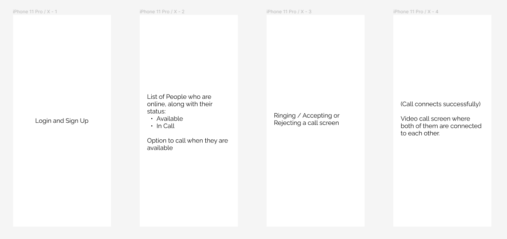
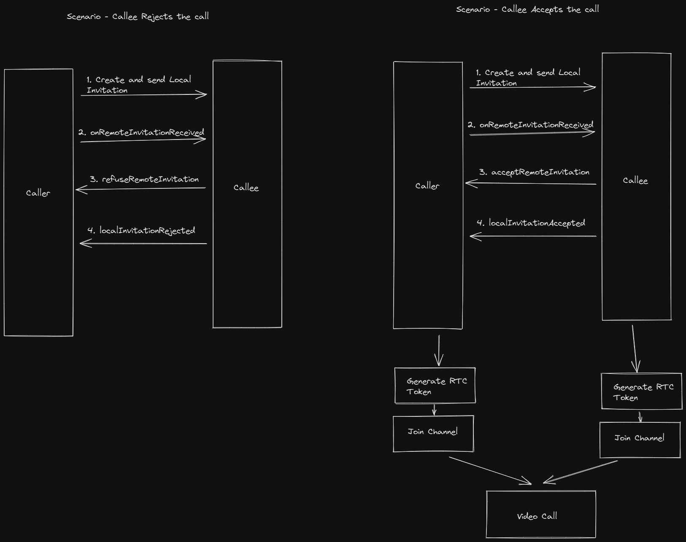

# Agora Task

### Link to the demo video
[Demo Video](https://youtu.be/TfuZnQPjZgo)

### Features Implemented:
- [x] Email Authentication with Firebase
- [x] User creation in Firebase realtime database
- [x] Fetching the list of online users from the realtime database
- [x] Fetching RTM Token from a Token Server
- [x] RTMCallManager for managing call invites
- [x] Fetching RTC Token from a Token Server before joining the channel
- [x] Basic video call functionalities like muting audio and turning off camera

### Initial thought process

### The Overview of the App Flow

### Notable technology used:
- Firebase Authentication for Sign In / Sign Up
- Firebase Realtime Database to keep a track of the users and also for showing the list of online users
- Agora RTM and RTMCallManager for call invitation
- Agora RTC for the video call
- ViewModels
- Dagger Hilt for dependency injection
- Fuel for making network requests to the token server
- LiveData for observable pattern
- SharedPreferences to store some information locally
